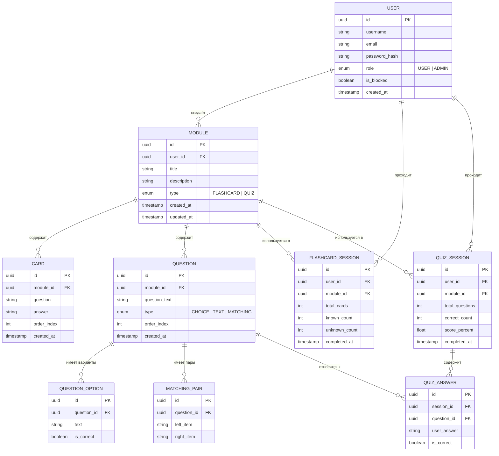

# QuizoO — Функциональные требования, ER и Use Case диаграммы

Ниже **п. «задание»** означает формулировки из официального задания на курсовой проект (роли и перечень функций в пояснительной записке, п. 2.1–2.2). Пометка **(доп.)** — расширение спецификации проекта сверх этого минимума.

---

# 1. Функциональные требования

## 1.1 Роль «Гость» — регистрация и аутентификация (задание)

| ID    | Требование                                                                                        | Примечание                             |
| ----- | ------------------------------------------------------------------------------------------------- | -------------------------------------- |
| FR-01 | Система должна поддерживать регистрацию пользователя по email и паролю                            | задание                                |
| FR-02 | Система должна поддерживать авторизацию с выдачей Access и Refresh токенов (JWT)                  | задание + (доп.) детализация через JWT |
| FR-03 | Система должна обновлять Access токен через Refresh токен без повторного логина                   | (доп.)                                 |
| FR-04 | Пароль должен храниться в виде хэша (bcrypt)                                                      | (доп.) безопасное хранение             |
| FR-05 | Незарегистрированный пользователь не имеет доступа ни к одной странице кроме логина и регистрации | задание                                |
| FR-O1 | Опциональный вход через Google OAuth 2.0 (альтернатива паролю)                                    | (доп.) сверх п. 2.1                    |

---

## 1.2 Функциональные требования — Пользователь (USER)

### Управление модулями

| ID    | Требование                                                   |
| ----- | ------------------------------------------------------------ |
| FR-10 | Пользователь может создать модуль типа «Карточки» или «Квиз» |
| FR-11 | Пользователь может редактировать название и описание модуля  |
| FR-12 | Пользователь может удалить свой модуль                       |
| FR-13 | Пользователь видит только свои модули на дашборде            |

### Карточки

| ID    | Требование                                                                      |
| ----- | ------------------------------------------------------------------------------- |
| FR-20 | Пользователь может добавлять карточки (вопрос + ответ) в модуль типа «Карточки» |
| FR-21 | Пользователь может редактировать и удалять карточки внутри модуля               |
| FR-22 | Минимальное количество карточек для запуска режима — 2                          |

### Квизы

| ID    | Требование                                                                        |
| ----- | --------------------------------------------------------------------------------- |
| FR-30 | Пользователь может добавлять вопросы в модуль типа «Квиз»                         |
| FR-31 | Вопрос может быть одного из трёх типов: выбор варианта, ввод текста, соответствие |
| FR-32 | Для типа «выбор варианта» пользователь задаёт 4 варианта и отмечает правильный    |
| FR-33 | Для типа «ввод текста» пользователь задаёт вопрос и эталонный ответ               |
| FR-34 | Для типа «соответствие» пользователь задаёт минимум 3 пары «термин → определение» |
| FR-35 | Минимальное количество вопросов для запуска квиза — 2                             |

### Режим карточек (Flashcards)

| ID    | Требование                                                             |
| ----- | ---------------------------------------------------------------------- |
| FR-40 | Пользователь может запустить режим карточек для модуля типа «Карточки» |
| FR-41 | Карточки показываются по одной, сначала лицевая сторона (вопрос)       |
| FR-42 | Пользователь может перевернуть карточку, чтобы увидеть ответ           |
| FR-43 | После просмотра пользователь отмечает «Знал» или «Не знал»             |
| FR-44 | Карточки с отметкой «Не знал» показываются повторно в конце стопки     |
| FR-45 | По завершении сессии отображается итог: кол-во «Знал» и «Не знал»      |

### Режим квиза

| ID    | Требование                                                                                   |
| ----- | -------------------------------------------------------------------------------------------- |
| FR-50 | Пользователь может запустить квиз для модуля типа «Квиз»                                     |
| FR-51 | Вопросы показываются последовательно, по одному                                              |
| FR-52 | Для типа «выбор варианта» — отображаются 4 варианта, нельзя изменить ответ после выбора      |
| FR-53 | Для типа «ввод текста» — сравнение без учёта регистра и лишних пробелов                      |
| FR-54 | Для типа «соответствие» — пользователь соединяет пары кликом                                 |
| FR-55 | По завершении отображается экран результатов: процент, кол-во верных/неверных, разбор ошибок |
| FR-56 | Результат сессии сохраняется в историю                                                       |

### Статистика

| ID    | Требование                                                                                                |
| ----- | --------------------------------------------------------------------------------------------------------- | --------------------------------------------------------------- |
| FR-60 | Пользователь может просмотреть историю прохождений по каждому модулю                                      |
| FR-61 | Пользователь видит процент правильных ответов в динамике (последние N сессий)                             |
| FR-62 | На странице профиля отображается общая статистика: кол-во модулей, сессий, средний балл                   | задание («статистика» в профиле)                                |
| FR-63 | Пользователь может редактировать данные профиля: отображаемое имя (username), email, смена пароля         | задание                                                         |
| FR-64 | Пользователь может выйти из системы (завершение клиентской сессии, инвалидация refresh-токена на сервере) | (доп.) в п. 2.1 явно не названо; необходимо для завершённого UX |

---

## 1.3 Функциональные требования — Администратор (ADMIN)

| ID    | Требование                                                                            |
| ----- | ------------------------------------------------------------------------------------- |
| FR-70 | Администратор имеет доступ к административной панели                                  |
| FR-71 | Администратор может просматривать список всех пользователей с пагинацией              |
| FR-72 | Администратор может заблокировать или разблокировать пользователя                     |
| FR-73 | Заблокированный пользователь не может войти в систему                                 |
| FR-74 | Администратор может просматривать все модули всех пользователей                       |
| FR-75 | Администратор может удалить любой модуль                                              |
| FR-76 | Администратор видит общую статистику платформы: кол-во пользователей, модулей, сессий |

---

## 1.4 Нефункциональные требования

| ID     | Требование                                                                                 | Примечание                 |
| ------ | ------------------------------------------------------------------------------------------ | -------------------------- |
| NFR-01 | Приложение должно быть адаптивным: Mobile (<768px), Tablet (768–1024px), Desktop (1024px+) | (доп.)                     |
| NFR-02 | Все API роуты (кроме auth) защищены JWT                                                    | (доп.)                     |
| NFR-03 | Время ответа API не должно превышать 500мс при нормальной нагрузке                         | (доп.)                     |
| NFR-04 | Приложение разворачивается через Docker Compose одной командой                             | (доп.)                     |
| NFR-05 | Секреты и конфигурация хранятся в .env файлах, не в коде                                   | (доп.)                     |
| NFR-06 | Пользователь не может изменять или удалять чужие модули                                    | задание (следует из ролей) |

### Соответствие п. 2.2 задания (технические ограничения)

| Тема                                                      | Как закрывается в проекте                               |
| --------------------------------------------------------- | ------------------------------------------------------- |
| Асинхронное программирование                              | async/await на сервере (NestJS), асинхронный UI (React) |
| Реляционная БД                                            | PostgreSQL                                              |
| Работа на разных платформах                               | браузер + контейнеризация (Docker)                      |
| Разделение слоёв представления, бизнес-логики и хранилища | React → REST API → NestJS → PostgreSQL                  |
| Язык JavaScript, платформа Node.js                        | TypeScript/JavaScript, Node.js                          |
| Асинхронный, завершённый, понятный UI                     | SPA на React                                            |
| Комментарии в исходном коде                               | по мере реализации модулей                              |

---

# 2. ER Диаграмма (Entity-Relationship)

---

# 3. Use Case Диаграмма

```mermaid
graph TB
    subgraph Actors["Участники"]
        Guest["👤 Гость"]
        User["👤 Пользователь"]
        Admin["👤 Администратор"]
    end

    subgraph Auth["Авторизация"]
        UC1["Зарегистрироваться"]
        UC2["Войти в систему"]
        UC2a["Войти через Google (OAuth)"]
        UC3["Выйти из системы"]
        UC4["Обновить токен"]
    end

    subgraph Modules["Управление модулями"]
        UC10["Создать модуль (Карточки)"]
        UC11["Создать модуль (Квиз)"]
        UC12["Редактировать модуль"]
        UC13["Удалить модуль"]
        UC14["Просмотреть свои модули"]
    end

    subgraph Cards["Карточки"]
        UC20["Добавить карточку"]
        UC21["Редактировать карточку"]
        UC22["Удалить карточку"]
    end

    subgraph Questions["Вопросы квиза"]
        UC30["Добавить вопрос: Выбор варианта"]
        UC31["Добавить вопрос: Ввод текста"]
        UC32["Добавить вопрос: Соответствие"]
        UC33["Редактировать вопрос"]
        UC34["Удалить вопрос"]
    end

    subgraph Learning["Обучение"]
        UC40["Запустить режим Карточки"]
        UC41["Перевернуть карточку"]
        UC42["Отметить Знал / Не знал"]
        UC43["Запустить квиз"]
        UC44["Ответить на вопрос"]
        UC45["Просмотреть результат квиза"]
    end

    subgraph Stats["Статистика и профиль"]
        UC50["Просмотреть историю сессий"]
        UC51["Просмотреть прогресс по модулю"]
        UC52["Просмотреть профиль и общую статистику"]
        UC53["Редактировать профиль"]
    end

    subgraph AdminPanel["Администрирование"]
        UC60["Просмотреть всех пользователей"]
        UC61["Заблокировать пользователя"]
        UC62["Разблокировать пользователя"]
        UC63["Просмотреть все модули"]
        UC64["Удалить любой модуль"]
        UC65["Просмотреть статистику платформы"]
    end

    Guest --> UC1
    Guest --> UC2
    Guest --> UC2a

    User --> UC2
    User --> UC2a
    User --> UC3
    User --> UC4
    User --> UC10
    User --> UC11
    User --> UC12
    User --> UC13
    User --> UC14
    User --> UC20
    User --> UC21
    User --> UC22
    User --> UC30
    User --> UC31
    User --> UC32
    User --> UC33
    User --> UC34
    User --> UC40
    User --> UC41
    User --> UC42
    User --> UC43
    User --> UC44
    User --> UC45
    User --> UC50
    User --> UC51
    User --> UC52
    User --> UC53

    Admin --> UC60
    Admin --> UC61
    Admin --> UC62
    Admin --> UC63
    Admin --> UC64
    Admin --> UC65
    Admin --> UC3
```

---

# 4. Краткое описание Use Case — ключевые сценарии

## UC-40: Запустить режим Карточки

- **Актор:** Пользователь
- **Предусловие:** Модуль типа «Карточки» содержит не менее 2 карточек
- **Основной поток:**
  1. Пользователь открывает модуль и нажимает «Карточки»
  2. Система перемешивает карточки и показывает первую (лицевая сторона)
  3. Пользователь нажимает «Перевернуть»
  4. Система показывает обратную сторону (ответ)
  5. Пользователь нажимает «Знал» или «Не знал»
  6. Шаги 2–5 повторяются; карточки «Не знал» добавляются в конец стопки
  7. Когда все карточки пройдены — отображается итоговый экран
- **Постусловие:** Сессия сохраняется в историю

## UC-43: Запустить квиз

- **Актор:** Пользователь
- **Предусловие:** Модуль типа «Квиз» содержит не менее 2 вопросов
- **Основной поток:**
  1. Пользователь открывает модуль и нажимает «Квиз»
  2. Система показывает вопросы по одному в случайном порядке
  3. Пользователь отвечает на каждый вопрос
  4. Система фиксирует правильность ответа (нельзя изменить после отправки)
  5. После последнего вопроса — экран результатов с разбором ошибок
- **Постусловие:** Результат сессии сохраняется в историю

## UC-53: Редактировать профиль

- **Актор:** Пользователь
- **Предусловие:** Пользователь авторизован
- **Основной поток:**
  1. Пользователь открывает страницу профиля
  2. Изменяет username, email и/или пароль (с подтверждением старого пароля при смене)
  3. Система валидирует данные и сохраняет изменения
- **Постусловие:** Данные профиля обновлены; при смене email может потребоваться повторная аутентификация (по политике проекта)

## UC-61: Заблокировать пользователя

- **Актор:** Администратор
- **Предусловие:** Пользователь существует и не заблокирован
- **Основной поток:**
  1. Администратор открывает список пользователей
  2. Выбирает пользователя и нажимает «Заблокировать»
  3. Система устанавливает флаг is_blocked = true
  4. Все активные токены пользователя инвалидируются
- **Постусловие:** Пользователь не может войти в систему
