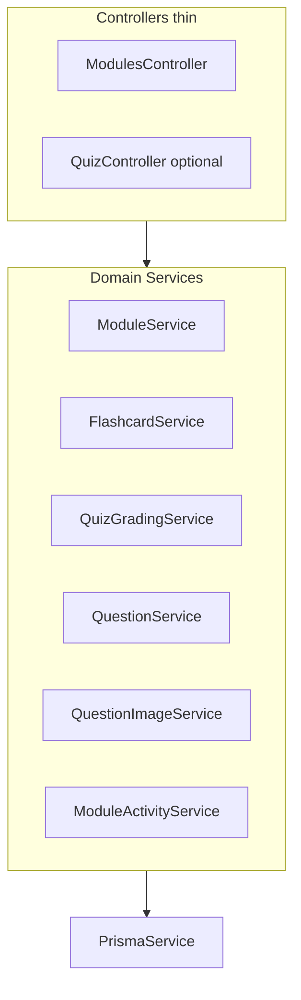

# QuizoO — бэклог разработки

Приоритизированный список задач по качественной переработке проекта.  
**Контекст для AI:** [`AIContext.md`](./AIContext.md) · **Правила кода:** [`.cursor/`](../.cursor/)

---

## Фаза A — Архитектура backend (критично)

**Проблема:** [`modules.service.ts`](../backend/src/modules/modules.service.ts) — ~1324 строки, god object (CRUD модулей, flashcards, quiz grading, questions, images, activity feed).

**Целевой паттерн:** Controller → Domain Service → Prisma. Один класс = одна ответственность. Без лишних слоёв (repository только если реально нужен).



### A.1 Декомпозиция сервисов

- [ ] Вынести grading из `createQuizSession` → `QuizGradingService`
  - Файл: `backend/src/modules/quiz/quiz-grading.service.ts`
  - Методы: `gradeAnswers(questions, answers)`, типы payload для CHOICE/TEXT/MATCHING
- [ ] Вынести CRUD вопросов + `validateChoiceOptions` → `QuestionService`
  - Файл: `backend/src/modules/quiz/question.service.ts`
- [ ] Вынести flashcards (cards + sessions) → `FlashcardService`
  - Файл: `backend/src/modules/flashcard/flashcard.service.ts`
- [ ] Вынести FS-логику картинок → `QuestionImageService`
  - Файл: `backend/src/modules/quiz/question-image.service.ts`
- [ ] Вынести dashboard/activity + raw SQL → `ModuleActivityService`
  - Файл: `backend/src/modules/module-activity.service.ts`
- [ ] Оставить в `ModuleService` только CRUD модулей и access guards
- [ ] Обновить `ModulesModule` — регистрация всех providers
- [ ] Обновить/разбить unit-тесты по новым сервисам

### A.2 DTO и валидация

- [ ] DTO с `class-validator` для **всех** quiz/card/question endpoints
  - Сейчас только [`create-module.dto.ts`](../backend/src/modules/dto/create-module.dto.ts)
  - Создать: `create-card.dto.ts`, `update-card.dto.ts`, `create-question.dto.ts`, `update-question.dto.ts`, `create-quiz-session.dto.ts`, `create-flashcard-session.dto.ts`
- [ ] Убрать inline `{ question?: string; ... }` из [`modules.controller.ts`](../backend/src/modules/modules.controller.ts)
- [ ] Проверить, что глобальный `ValidationPipe` в [`main.ts`](../backend/src/main.ts) покрывает новые DTO

### A.3 Controller (опционально)

- [ ] Разделить на `ModulesController` + `QuizController` (questions, sessions, images)
- [ ] Сохранить порядок маршрутов: `summary`, `activity` **до** `:moduleId`

### A.4 Критерий готовности фазы A

- [ ] Ни один service-файл > ~350 строк без обоснования
- [ ] Все существующие unit-тесты проходят
- [ ] API контракт не изменился (breaking changes — отдельная задача)

---

## Фаза B — Нормализация и форматирование ответов (TEXT)

**Проблема:** ответ «Paris» не засчитывается при эталоне «Париж». Сейчас только `trim().toLowerCase()` в [`modules.service.ts`](../backend/src/modules/modules.service.ts) (строки ~783–784).

### B.1 Модель данных

- [ ] Расширить схему — один из вариантов:
  - **Вариант A:** JSON-поле `acceptedVariants String[]` на `Question`
  - **Вариант B:** таблица `QuestionTextVariant` (`questionId`, `text`, `isCanonical`)
- [ ] Prisma migration + seed для demo-модулей при необходимости
- [ ] Для TEXT: эталон хранится в `QuestionOption` с `isCorrect: true` (текущая модель)

### B.2 Answer normalizer

- [ ] Создать [`backend/src/modules/quiz/answer-normalizer.ts`](../backend/src/modules/quiz/answer-normalizer.ts)
  - Базовая нормализация: trim, lowercase, Unicode NFKC, схлопывание пробелов
  - Сравнение с эталоном + списком допустимых вариантов
  - Возврат: `{ isCorrect, canonicalAnswer, normalizedUserInput }`
- [ ] Интегрировать в `QuizGradingService` (после фазы A)

### B.3 Persist и UI

- [ ] В `QuizAnswer.userAnswer` хранить нормализованный ввод
- [ ] В разборе ошибок показывать **каноническую форму** («Париж», а не «paris»)
- [ ] Frontend: поле «Допустимые варианты ответа» в [`EditQuizModulePage.tsx`](../frontend/src/pages/EditQuizModulePage.tsx)
- [ ] Import/export JSON — поддержка `acceptedVariants` в [`EditQuizModulePage.tsx`](../frontend/src/pages/EditQuizModulePage.tsx)

### B.4 Тесты

- [ ] Unit: Paris / париж / Париж, лишние пробелы, регистр, NFKC
- [ ] Unit: пустой ответ, только пробелы
- [ ] Integration: quiz session с вариантами ответа

---

## Фаза C — Новые типы вопросов

**Текущие типы:** `CHOICE`, `TEXT`, `MATCHING` ([`schema.prisma`](../backend/prisma/schema.prisma)).

**Уже есть, но не покрыто тестами:** multi-CHOICE (`allowMultipleAnswers`), MATCHING grading.

### C.0 Долг по существующим типам

- [ ] Unit-тесты: MATCHING grading
- [ ] Unit-тесты: multi-CHOICE (`allowMultipleAnswers: true`)
- [ ] E2E: quiz session с MIX типов

### C.1 TRUE_FALSE (P1)

- [ ] Prisma: добавить `TRUE_FALSE` в enum `QuestionType` + migration
- [ ] Backend: grading (2 options, один correct)
- [ ] Frontend editor + study UI
- [ ] Import/export JSON + i18n ([`messages.ts`](../frontend/src/i18n/messages.ts))
- [ ] Unit + e2e тесты

### C.2 ORDERING (P2)

- [ ] Prisma: `ORDERING` + модель элементов порядка (или JSON на Question)
- [ ] Backend: сравнение массива id в правильном порядке
- [ ] Frontend: drag-and-drop в editor и study
- [ ] Import/export + i18n + тесты

### C.3 FILL_BLANK (P2)

- [ ] Prisma: `FILL_BLANK` + blanks metadata
- [ ] Backend: grading нескольких пропусков (reuse answer normalizer)
- [ ] Frontend: шаблон текста с `{blank}` + поля ввода
- [ ] Import/export + i18n + тесты

### C.4 MULTI_TEXT (P3)

- [ ] Несколько текстовых полей на один вопрос (напр. «столица + страна»)
- [ ] Backend + frontend + тесты

### C.5 NUMERIC (P3)

- [ ] Числовой ответ с допуском (±epsilon)
- [ ] Backend + frontend + тесты

### Шаблон подзадач для каждого нового типа

```
Prisma enum + migration
→ backend grading (QuizGradingService)
→ DTO create/update question
→ frontend editor (EditQuizModulePage)
→ frontend study (QuizStudyPage)
→ import/export JSON
→ i18n (ru/en)
→ unit tests (grading)
→ e2e smoke
```

---

## Фаза D — Архитектурный паттерн frontend (FSD minimum)

**Текущее состояние:** папки по смыслу, FSD не используется ([`frontend-setup-from-step4.md`](./frontend-setup-from-step4.md) — устарело, см. AIContext).

**Цель:** постепенная миграция без big-bang.

```
frontend/src/
  app/          # providers, router (из main.tsx)
  pages/        # route screens (оставить)
  widgets/      # DashboardModuleList, QuizPlayer
  features/     # createModule, submitQuizAnswer, editQuestion
  entities/     # module, question, user — types + api
  shared/       # ui/, lib/, i18n/, hooks/
```

### D.1 Документация и rules

- [x] Зафиксировать целевую структуру в [`AIContext.md`](./AIContext.md)
- [x] Обновить [`.cursor/rules/frontend.mdc`](../.cursor/rules/frontend.mdc)
- [x] Добавить [`.cursor/rules/architecture.mdc`](../.cursor/rules/architecture.mdc)

### D.2 Pilot-миграция

- [ ] Создать `entities/module/` — перенести из [`types/module.ts`](../frontend/src/types/module.ts) + [`lib/api/modules.ts`](../frontend/src/lib/api/modules.ts)
- [ ] Создать `shared/ui/` — re-export из `components/ui/`
- [ ] Создать `shared/lib/` — re-export из `lib/`
- [ ] Обновить imports в 1–2 pages (pilot), не ломая остальное

### D.3 Правила импортов

- [ ] `pages` → `widgets`, `features`, `entities`, `shared`
- [ ] `features` → `entities`, `shared`
- [ ] `entities` → `shared` only
- [ ] Запрет обратных импортов (eslint-plugin-boundaries или ручной review)
- [ ] Постепенно переносить остальные domains: `entities/user`, `entities/question`

### D.4 app layer

- [ ] Вынести providers из [`main.tsx`](../frontend/src/main.tsx) в `app/providers.tsx`
- [ ] Вынести router в `app/router.tsx`

---

## Фаза E — Тестирование (Playwright + регрессия)

**Текущее состояние:** Jest unit на backend (4 spec-файла); e2e — только Hello World; Playwright отсутствует.

### E.1 Backend unit (расширить Jest)

- [ ] MATCHING grading tests
- [ ] multi-CHOICE grading tests
- [ ] `answer-normalizer` tests (после фазы B)
- [ ] `QuestionService` CRUD tests
- [ ] Покрытие grading ≥ 90% для `QuizGradingService`

### E.2 Backend e2e (NestJS)

- [ ] Auth flow: register → verify → login → cookie
- [ ] Module CRUD: create QUIZ module → add question → quiz session → assert score
- [ ] Admin: block user → forbidden for blocked user
- [ ] Test DB / docker-compose profile для CI

### E.3 Playwright (новое)

```
e2e/
  playwright.config.ts
  tests/
    auth.spec.ts
    quiz-flow.spec.ts
    flashcard-flow.spec.ts
    admin.spec.ts
  fixtures/
    test-user.ts
```

- [ ] Установить Playwright в корневой `e2e/` (или workspace)
- [ ] `playwright.config.ts` — baseURL, auth storage state
- [ ] Smoke: login → dashboard → create quiz → study → result
- [ ] Smoke: flashcard session
- [ ] Smoke: admin users list
- [ ] npm script: `npm run test:e2e` из корня
- [ ] CI job на PR (GitHub Actions)

### E.4 Регрессионное тестирование

- [ ] Зафиксировать **критические user flows** (список ниже) как regression suite
- [ ] Запуск regression suite на каждый PR
- [ ] При изменении quiz grading — обязательный прогон grading unit + quiz-flow e2e

**Критические flows:**

1. Регистрация + верификация email + login
2. Создание flashcard-модуля + study session
3. Создание quiz-модуля + CHOICE/TEXT/MATCHING + study + score
4. Профиль: смена username, avatar
5. Admin: block/unblock user

### E.5 Visual regression (опционально, P3)

- [ ] Playwright screenshot diff для dashboard, quiz study, admin panel
- [ ] Baseline images в git или artifact storage

---

## Фаза F — Глобальное логирование (Sentry)

**Текущее состояние:** `Logger` только в email-сервисе; централизованного error tracking нет.

### F.1 Backend

- [ ] Установить `@sentry/nestjs`, `@sentry/node`
- [ ] `SentryModule.forRoot()` в [`app.module.ts`](../backend/src/app.module.ts)
- [ ] Global exception filter: HTTP 5xx → Sentry event; 4xx → breadcrumb only
- [ ] Env vars: `SENTRY_DSN`, `SENTRY_ENVIRONMENT`, `SENTRY_RELEASE`
- [ ] Не логировать PII (email, пароли, JWT payload)

### F.2 Frontend

- [ ] Установить `@sentry/react`
- [ ] Init в [`main.tsx`](../frontend/src/main.tsx)
- [ ] Error boundary → [`RouteErrorPage.tsx`](../frontend/src/pages/RouteErrorPage.tsx)
- [ ] Source maps upload в CI (опционально)

### F.3 Общее

- [ ] Добавить Sentry vars в [`.env.example`](../.env.example)
- [ ] Документировать в [`AIContext.md`](./AIContext.md)
- [ ] Dev/staging: отдельные DSN или `SENTRY_ENVIRONMENT=development`

### F.4 Structured logging (дополнительно)

- [ ] NestJS Logger в domain services для ключевых операций (create session, grading errors)
- [ ] Request correlation id (middleware) — опционально, P3

---

## Порядок выполнения (рекомендуемый)

| #   | Фаза                           | Зависимости                 |
| --- | ------------------------------ | --------------------------- |
| 1   | A — backend split              | —                           |
| 2   | B — answer normalizer          | A (grading service)         |
| 3   | E.1 — unit tests grading       | A                           |
| 4   | F — Sentry                     | — (можно параллельно с A)   |
| 5   | E.3 — Playwright smoke         | —                           |
| 6   | C.0 — tests for existing types | A                           |
| 7   | C.1+ — new question types      | A, B                        |
| 8   | D — FSD migration              | — (постепенно, параллельно) |

---

## Связанные документы

| Документ                               | Когда читать                     |
| -------------------------------------- | -------------------------------- |
| [`AIContext.md`](./AIContext.md)       | Любая новая задача — старт здесь |
| [`api.md`](./api.md)                   | Детали REST API                  |
| [`db.md`](./db.md)                     | Схема БД                         |
| [`architecture.md`](./architecture.md) | Docker / Nginx / деплой          |
| [`checklist.md`](./checklist.md)       | Прогресс курсовой                |
| [`tests.md`](./tests.md)               | Ручные сценарии (legacy)         |
