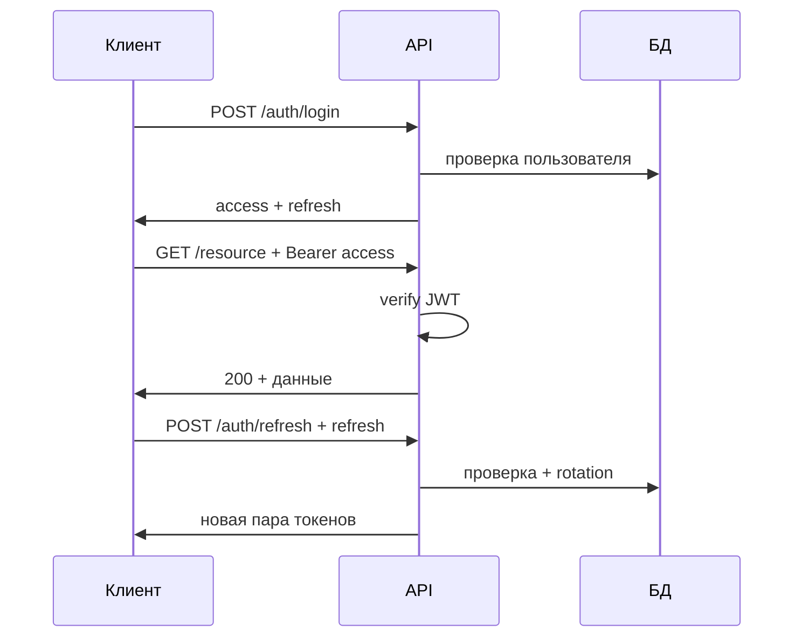

# QuizoO — Аутентификация и авторизация

Документ описывает типовую качественную архитектуру входа пользователя с **JWT**, **refresh-токенами**, защитой API и **protected routes** на фронтенде. Предназначен для согласования реализации backend и frontend.

---

## 1. Роли компонентов

| Компонент                    | Назначение                                                                                                                                                                                              |
| ---------------------------- | ------------------------------------------------------------------------------------------------------------------------------------------------------------------------------------------------------- |
| **JWT (access)**             | Короткоживущий токен, подтверждает личность при запросах к API. Подписан сервером, сервер при каждом запросе **проверяет подпись и срок действия** без обращения к БД (если не используется blocklist). |
| **Refresh-токен**            | Долгоживущий токен **только** для получения новой пары access/refresh без повторного ввода пароля. Хранится и проверяется строже, часто с привязкой к БД.                                               |
| **Protected routes (фронт)** | Условный рендер или редирект: «не показывать экран, пока нет сессии». Улучшает UX, **не заменяет** проверку на сервере.                                                                                 |
| **Защита API**               | Middleware/guard на каждом защищённом маршруте: нет валидного access (или сессии) → **401/403**, данные не отдаются.                                                                                    |

---

## 2. Схема с двумя токенами (рекомендуемый паттерн)

| Токен       | TTL                              | Где используется                                                                                             |
| ----------- | -------------------------------- | ------------------------------------------------------------------------------------------------------------ |
| **Access**  | Коротко (от минут до пары часов) | Заголовок `Authorization: Bearer <access>` (или cookie, см. ниже)                                            |
| **Refresh** | Дольше (дни/недели)              | Отдельный эндпоинт `POST /auth/refresh`; при **rotation** выдаётся новая пара, старый refresh инвалидируется |

**Зачем два токена:** украденный access быстро перестаёт действовать; refresh можно отозвать в БД, ограничить по устройству и при компрометации оборвать цепочку.

---

## 3. Хранение на клиенте

| Подход                                         | Плюсы                                              | Минусы                                                                                                       |
| ---------------------------------------------- | -------------------------------------------------- | ------------------------------------------------------------------------------------------------------------ |
| **`localStorage` / `sessionStorage` + Bearer** | Простая реализация SPA                             | Уязвимость при XSS: скрипт может прочитать токен                                                             |
| **HttpOnly + Secure + SameSite cookie**        | JS не читает cookie → меньше риска кражи через XSS | Нужно продумать **CSRF** для state-changing запросов (SameSite=Lax/Strict, CSRF-токен, double-submit и т.д.) |

Частая комбинация: **refresh в HttpOnly cookie**, **access в памяти** (переменная в приложении) или короткоживущий в cookie — зависит от SSR и единого домена API/фронта.

---

## 4. Потоки на backend

### 4.1 Регистрация / вход

1. Проверка учётных данных (пароль — **bcrypt** / **argon2**, не хранить в открытом виде).
2. Опционально: rate limiting на `/login`, 2FA.
3. Выдача **access** + **refresh**; refresh сохраняется в БД (хэш токена), чтобы поддерживать **logout** и **rotation**.

### 4.2 Защищённые эндпоинты

1. Извлечь токен из `Authorization` или cookie.
2. Верифицировать JWT (подпись, `exp`, опционально `iss`/`aud`).
3. Положить в контекст запроса `userId`, роли/permissions.
4. При необходимости проверить права на конкретное действие (RBAC).

### 4.3 Обновление сессии

1. `POST /auth/refresh` с refresh (cookie или тело — по выбранной схеме).
2. Проверить refresh в БД (не отозван, срок, привязка к пользователю/устройству).
3. Выдать **новую** пару токенов; при **refresh rotation** — инвалидировать использованный refresh.

### 4.4 Выход

1. Удалить/пометить refresh в БД.
2. Очистить cookie на клиенте; с клиента убрать access из памяти.

---

## 5. Protected routes (frontend)

### 5.1 Назначение

Скрыть страницы «только для авторизованных» и перенаправить на `/login` (с сохранением `returnUrl`), пока нет валидной сессии. Показать загрузку, пока идёт проверка токена/профиля.

### 5.2 Ограничение

Пользователь может подменить клиентский код или открыть URL напрямую. **Данные всё равно не получит** без валидного access на API. Protected route — про **навигацию и UX**, не про безопасность данных.

### 5.3 Типичная реализация (React Router)

- Обёртка маршрута, например `<ProtectedRoute>`, внутри: контекст auth → если не авторизован → `<Navigate to="/login" state={{ from: location }} />`.
- Для ролей: то же с условием `user.role === 'admin'`.

### 5.4 SSR / fullstack-фреймворки

В **middleware** по cookie/JWT можно редиректить **до** отдачи HTML — пользователь не увидит защищённую разметку; API всё равно остаётся источником истины.

---

## 6. Диаграмма последовательности (обзор)

---

## 7. Чеклист безопасности (кратко)

- Пароли: сильный хэш, соль, без логирования паролей.
- HTTPS в продакшене.
- Короткий TTL access; refresh с rotation и хранением в БД.
- Rate limit на логин и чувствительные эндпоинты.
- При cookie: **Secure**, **SameSite**, продуманный **CSRF** для изменяющих запросов.
- `401` при истёкшем/невалидном токене; на клиенте — попытка refresh или редирект на логин.
- Опционально: blocklist для access при logout со всех устройств (если храните jti).

---

## 8. Связь с проектом QuizoO

При внедрении в репозиторий:

- Зафиксировать контракт API (`/auth/login`, `/auth/register`, `/auth/refresh`, `/auth/logout`) и формат ошибок.
- Единый `AuthProvider` (или аналог) на фронте: хранение состояния пользователя, обёртка для protected routes, перехватчик `fetch`/axios для подстановки Bearer и обработки 401 → refresh.

Этот файл можно дополнять конкретными путями эндпоинтов и полями DTO по мере реализации.
