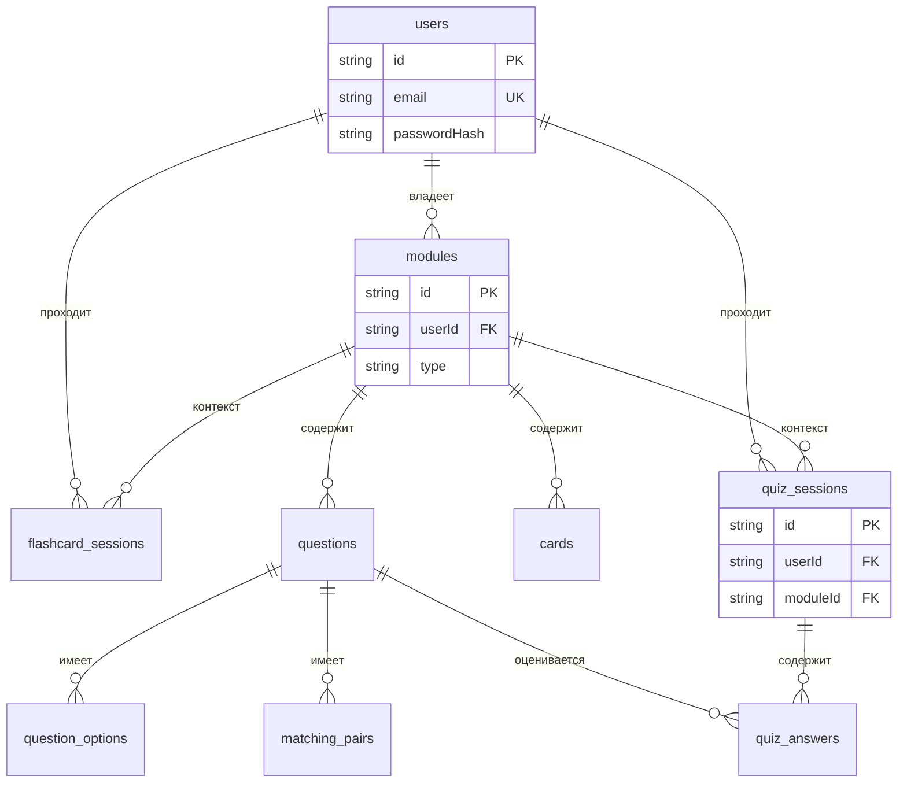

# QuizoO — схема базы данных

Доменные сущности и связи. Реализация: [PostgreSQL](https://www.postgresql.org/) + [Prisma](https://www.prisma.io/) (`backend/prisma/schema.prisma`).

---

## Оглавление

1. [ER-диаграмма](#er-диаграмма)
2. [Сущности](#сущности)
3. [Связи (что к чему)](#связи-что-к-чему)
4. [Перечисления](#перечисления)
5. [Поля вне изначально краткой схемы (добавлено)](#поля-вне-изначально-краткой-схемы-добавлено)
6. [Расширения и пояснения](#расширения-и-пояснения)
7. [Заметки и возможные доработки](#заметки-и-возможные-доработки)

---

## ER-диаграмма

---

## Сущности

### `users` — пользователи

Краткая изначальная схема в репозитории описывала: `id`, `email`, `passwordHash`, `username`, `role`, `isBlocked`, `oauthProvider`, `oauthId`, `createdAt`, `updatedAt`. Ниже — полный список; поля, которых **не было** в той краткой строке, помечены **(добавлено)**.

| Поле                         | Тип    | Описание                                                 |
| ---------------------------- | ------ | -------------------------------------------------------- |
| `id`                         | PK     | Идентификатор (cuid)                                     |
| `email`                      | unique | Почта (логин)                                            |
| `passwordHash`               | string | Хеш пароля (bcrypt)                                      |
| `username`                   | null   | Отображаемое имя                                         |
| `role`                       | enum   | `USER` / `ADMIN`                                         |
| `isBlocked`                  | bool   | Блокировка учётной записи                                |
| `oauthProvider`              | null   | Код провайдера OAuth (например `google`)                 |
| `oauthId`                    | null   | Субъект у провайдера; в паре с `oauthProvider` уникален  |
| `emailVerified`              | bool   | Подтверждён ли email **(добавлено)**                     |
| `emailVerificationCode`      | null   | Одноразовый код подтверждения **(добавлено)**            |
| `emailVerificationExpiresAt` | null   | Срок действия кода **(добавлено)**                       |
| `passwordResetCode`          | null   | Код сброса пароля **(добавлено)**                        |
| `passwordResetExpiresAt`     | null   | Срок действия кода сброса **(добавлено)**                |
| `avatarMime`                 | null   | MIME аватара (файл на диске по `userId`) **(добавлено)** |
| `createdAt`                  | auto   | Создание                                                 |
| `updatedAt`                  | auto   | Обновление                                               |

**Ограничение (добавлено):** уникальная пара `oauthProvider` + `oauthId` — дубли OAuth-аккаунта не заводим; для учёток только с email/паролем оба поля `NULL` (в PostgreSQL для `UNIQUE` это допустимо: несколько строк `NULL, NULL`).

Подробнее о смысле кодов и сроков — в разделе [Расширения и пояснения](#расширения-и-пояснения).

---

### `modules` — учебные модули (наборы карточек или квизов)

| Поле          | Тип          | Описание               |
| ------------- | ------------ | ---------------------- |
| `id`          | PK           |                        |
| `userId`      | FK → `users` | Владелец               |
| `title`       |              | Название               |
| `description` | null         | Описание               |
| `type`        | enum         | `FLASHCARD` или `QUIZ` |
| `createdAt`   |              |                        |
| `updatedAt`   |              |                        |

---

### `cards` — карточки (режим «флэшкарты»)

| Поле         | Тип | Описание               |
| ------------ | --- | ---------------------- |
| `id`         | PK  |                        |
| `moduleId`   | FK  | → `modules`            |
| `question`   |     | Вопрос / лицо карточки |
| `answer`     |     | Ответ                  |
| `orderIndex` | int | Порядок                |
| `createdAt`  |     |                        |

---

### `flashcard_sessions` — сессии прохождения флэшкарт

| Поле           | Тип  | Описание               |
| -------------- | ---- | ---------------------- |
| `id`           | PK   |                        |
| `userId`       | FK   | → `users`              |
| `moduleId`     | FK   | → `modules`            |
| `totalCards`   | int  | Всего карточек         |
| `knownCount`   | int  | «Знаю»                 |
| `unknownCount` | int  | «Не знаю»              |
| `completedAt`  | null | Когда завершена сессия |

---

### `questions` — вопросы (режим «квиз»)

| Поле           | Тип  | Описание                       |
| -------------- | ---- | ------------------------------ |
| `id`           | PK   |                                |
| `moduleId`     | FK   | → `modules`                    |
| `questionText` |      | Текст вопроса                  |
| `type`         | enum | `CHOICE` / `TEXT` / `MATCHING` |
| `orderIndex`   |      | Порядок                        |
| `createdAt`    |      |                                |

---

### `question_options` — варианты ответа (для `CHOICE`)

| Поле         | Тип  | Описание        |
| ------------ | ---- | --------------- |
| `id`         | PK   |                 |
| `questionId` | FK   | → `questions`   |
| `text`       |      | Текст варианта  |
| `isCorrect`  | bool | Верный ли ответ |

---

### `matching_pairs` — пары «слева–справа» (для `MATCHING`)

| Поле         | Тип | Описание      |
| ------------ | --- | ------------- |
| `id`         | PK  |               |
| `questionId` | FK  | → `questions` |
| `leftItem`   |     |               |
| `rightItem`  |     |               |

---

### `quiz_sessions` — сессии прохождения квиза

| Поле             | Тип   | Описание        |
| ---------------- | ----- | --------------- |
| `id`             | PK    |                 |
| `userId`         | FK    | → `users`       |
| `moduleId`       | FK    | → `modules`     |
| `totalQuestions` | int   | Всего вопросов  |
| `correctCount`   | int   | Верных ответов  |
| `scorePercent`   | float | Оценка, %       |
| `completedAt`    | null  | Когда завершена |

---

### `quiz_answers` — ответы в рамках квиз-сессии

| Поле         | Тип  | Описание                           |
| ------------ | ---- | ---------------------------------- |
| `id`         | PK   |                                    |
| `sessionId`  | FK   | → `quiz_sessions`                  |
| `questionId` | FK   | → `questions`                      |
| `userAnswer` | null | Сериализованный ответ (текст/JSON) |
| `isCorrect`  | bool | Верно ли                           |

**Ограничение (добавлено):** уникальная пара `(sessionId, questionId)` — в изначальном перечислении полей не указывалось; в БД: один ответ на вопрос в рамках сессии, без дублей.

---

## Связи (что к чему)

| Родитель (1)    | Потомок (N)          | Ключ / FK                     |
| --------------- | -------------------- | ----------------------------- |
| `users`         | `modules`            | `modules.userId`              |
| `users`         | `flashcard_sessions` | `flashcard_sessions.userId`   |
| `users`         | `quiz_sessions`      | `quiz_sessions.userId`        |
| `modules`       | `cards`              | `cards.moduleId`              |
| `modules`       | `questions`          | `questions.moduleId`          |
| `modules`       | `flashcard_sessions` | `flashcard_sessions.moduleId` |
| `modules`       | `quiz_sessions`      | `quiz_sessions.moduleId`      |
| `questions`     | `question_options`   | `question_options.questionId` |
| `questions`     | `matching_pairs`     | `matching_pairs.questionId`   |
| `questions`     | `quiz_answers`       | `quiz_answers.questionId`     |
| `quiz_sessions` | `quiz_answers`       | `quiz_answers.sessionId`      |

Семантически везде **один ко многим** с каскадом при удалении родителя (см. Prisma `onDelete: Cascade`).

---

## Перечисления

| Имя            | Значения                     |
| -------------- | ---------------------------- |
| `UserRole`     | `USER`, `ADMIN`              |
| `ModuleType`   | `FLASHCARD`, `QUIZ`          |
| `QuestionType` | `CHOICE`, `TEXT`, `MATCHING` |

---

## Поля вне изначально краткой схемы (добавлено)

Сводка: во всех **доменных** таблицах из раздела [Сущности](#сущности) от краткого перечня в `users` отличались только перечисленные выше **(добавлено)**-поля и **помеченные** ограничения; `oauthProvider` / `oauthId` в краткую схему **входили** — к «добавлено» к полям не относятся.

| Сущность / артефакт                                                                                                                          | Статус                                                         |
| -------------------------------------------------------------------------------------------------------------------------------------------- | -------------------------------------------------------------- |
| `users`: `emailVerified`, `emailVerificationCode`, `emailVerificationExpiresAt`, `passwordResetCode`, `passwordResetExpiresAt`, `avatarMime` | **(добавлено)**                                                |
| `users`: уникальный индекс `(oauthProvider, oauthId)`                                                                                        | **(добавлено)** — как ограничение, не отдельные колонки        |
| `quiz_answers`: уникальность `(sessionId, questionId)`                                                                                       | **(добавлено)**                                                |
| Таблица `Click`                                                                                                                              | **(добавлено)** — см. ниже, не в доменной схеме квизов/модулей |

### Таблица `Click` **(добавлено)**

| Поле        | Тип  | Описание             |
| ----------- | ---- | -------------------- |
| `id`        | PK   | Идентификатор (cuid) |
| `createdAt` | auto | Метка времени        |

Демо для проверки API; **не** часть учебного домена QuizoO. Можно удалить вместе с демо-эндпоинтами.

---

## Расширения и пояснения

Здесь — зачем поля, помеченные **(добавлено)** у `users` (само­хостинг, email-флоу, аватар), без повторения полного списка.

| Сущность / поле                                        | Назначение                                                                                                                                                                                                                                                                                                                                                                          |
| ------------------------------------------------------ | ----------------------------------------------------------------------------------------------------------------------------------------------------------------------------------------------------------------------------------------------------------------------------------------------------------------------------------------------------------------------------------- |
| `emailVerified`                                        | Подтверждён ли email.                                                                                                                                                                                                                                                                                                                                                               |
| `emailVerificationCode` + `emailVerificationExpiresAt` | **Одноразовый код** и **срок жизни**. Код нельзя хранить в JWT надёжно для «ввёл код → залогинен», пока сессия не выдана; хранение в БД вместе с `expires` позволяет: отклонить просроченный код, не держать отдельный Redis, не плодить анонимные сессии до верификации. Альтернатива: Redis `SET key code EX 900` / таблица `verification_tokens` с отдельной строкой на попытку. |
| `passwordResetCode` + `passwordResetExpiresAt`         | Аналогично для **сброса пароля**.                                                                                                                                                                                                                                                                                                                                                   |
| `avatarMime`                                           | Мета для локально сохранённого аватара (файл на диске по `userId`).                                                                                                                                                                                                                                                                                                                 |

---

## Заметки и возможные доработки

1. **OAuth** — в схеме есть `oauthProvider` / `oauthId`; **эндпоинты** «Войти через Google» и т.д. ещё нужно подключить. Если появятся **только** OAuth-аккаунты без пароля, разумно сделать `passwordHash` **опциональным** и в коде запрещать смену пароля без установленного пароля.
2. **Верификация и сброс** — при высоком трафике вынести коды в Redis с TTL, оставив в `users` только `emailVerified` / флаги; для текущего масштаба хранение в `users` проще.
3. **Сессии обучения** — при необходимости **непрошитых** (draft) сессий можно добавить `startedAt`, `durationSec`.
4. **Согласованность `modules.type` и контента** — на уровне приложения: у модуля `QUIZ` не должны создаваться `cards` и т.д.; при желании — CHECK или триггеры в SQL (усложнение).

Если схема в коде разойдётся с этим документом, **источник правды** — `backend/prisma/schema.prisma` и миграции в `backend/prisma/migrations/`.
