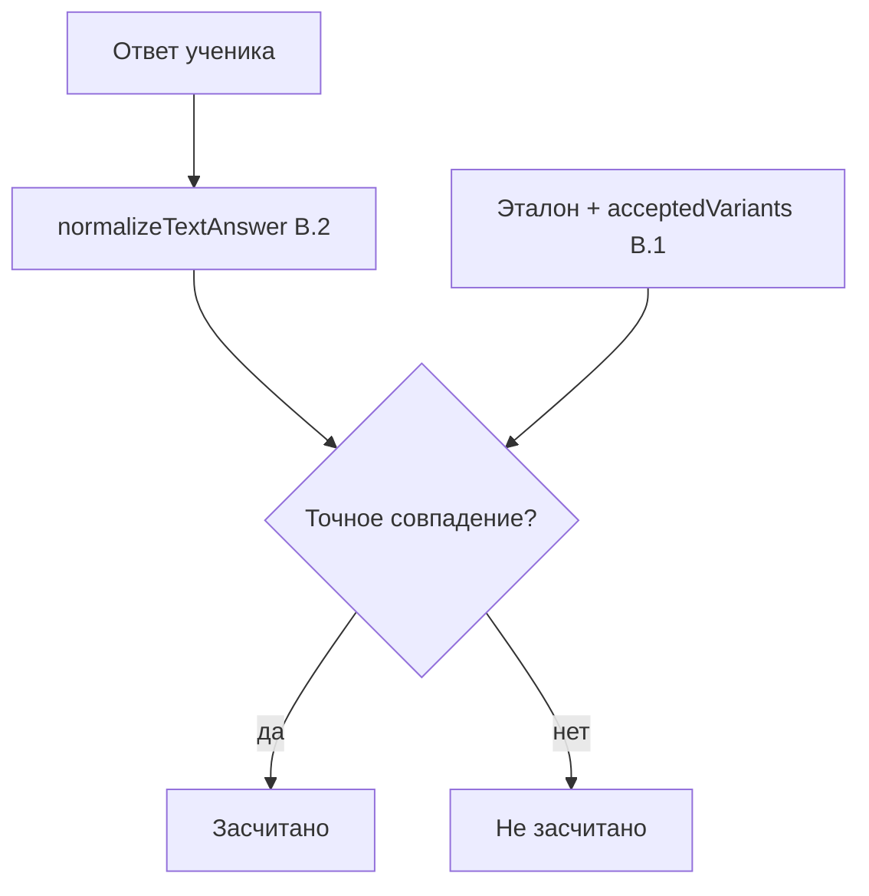

# Сессия 2026-06-30 — фаза B.1: допустимые варианты TEXT

**Ветка:** `feat_add-accepted-answers-and-tests` (локально, ещё не закоммичено)  
**Связанный бэклог:** [`TODO.md`](../TODO.md) → фаза B.1  
**Предыдущий шаг:** [B.2 answer normalizer](./2026-06-30-b2-answer-normalizer.md)

---

## Проблема

TEXT-вопрос: эталон **«Париж»**, ученик пишет **«Paris»**.

После B.2 (нормализация) это **всё ещё не засчитывалось** — нормализация не переводит языки, только приводит строку к единому виду (регистр, пробелы, Unicode).

---

## Решение B.1

Автор вопроса может указать **список допустимых синонимов** — `acceptedVariants`.

| Поле                        | Где                                  | Пример           |
| --------------------------- | ------------------------------------ | ---------------- |
| Эталон (канонический ответ) | `QuestionOption` с `isCorrect: true` | `Париж`          |
| Допустимые варианты         | `Question.acceptedVariants[]`        | `Paris`, `paris` |

При проверке ответ сравнивается с **эталоном + всеми variants** (после нормализации из B.2).

---

## Что изменилось в коде

### База данных

- Новое поле `acceptedVariants` (`TEXT[]`, по умолчанию `[]`) в таблице `questions`
- Миграция: `backend/prisma/migrations/20260630120000_add_question_accepted_variants/`
- В demo-квизе вопрос «Назовите столицу Франции» уже с variants `Paris`, `paris`

### Backend

| Файл                    | Изменение                                                                        |
| ----------------------- | -------------------------------------------------------------------------------- |
| `schema.prisma`         | поле `acceptedVariants String[]`                                                 |
| `answer-normalizer.ts`  | `sanitizeAcceptedVariants()` — trim, dedupe, убрать дубль эталона                |
| `modules.service.ts`    | create/update TEXT сохраняют variants; grading передаёт их в `gradeTextAnswer()` |
| `modules.controller.ts` | API принимает `acceptedVariants` в body                                          |

### Frontend

| Файл                                    | Изменение                                                   |
| --------------------------------------- | ----------------------------------------------------------- |
| `EditQuizModulePage.tsx`                | textarea «Допустимые варианты ответа» (по одному на строку) |
| JSON import/export                      | поле `acceptedVariants` для TEXT                            |
| `types/module.ts`, `lib/api/modules.ts` | типы и API                                                  |

---

```text
Эталон:     Париж
Variants:   Paris      ← другой язык / написание
            Приж       ← опечатка, которую автор явно разрешил
            Паариж

Ответ ученика     → Засчитывается?
─────────────────────────────────
Париж, париж, ПАРИЖ   → да (эталон, регистр не важен)
Paris, PARIS          → да (variant Paris)
приж, ПРИЖ,  Приж    → да (variant Приж — регистр не важен)
Паариж                → да (variant Паариж)
приж без variant Приж → нет (эталон «Париж» ≠ «приж»)
Парж                  → нет (нет в списке, fuzzy не включён)
```

**Важно:** нормализация (регистр, пробелы, Unicode) применяется **и к ответу ученика, и к эталону, и к каждому variant**. Но **буквы должны совпасть** с одной из строк списка — «приж» не превращается автоматически в «Париж», только если вы сами добавили «Приж» в variants.

---

## Как проверить

### 1. Применить миграцию

```bash
cd backend
npx prisma migrate deploy
# или для dev:
npx prisma migrate dev
```

### 2. Автотесты

```bash
cd backend && npm test
```

Ожидание: все тесты проходят, в т.ч. кейс «эталон Париж + variant Paris → ответ Paris = correct».

### 3. Через UI (ручной сценарий)

1. Запустить backend + frontend (как обычно: Docker или `npm run dev`)
2. Войти под обычным пользователем (не admin)
3. Создать или открыть **квиз-модуль**
4. Добавить вопрос типа **TEXT**:
   - Вопрос: `Назовите столицу Франции`
   - Правильный ответ: `Париж`
   - Допустимые варианты (textarea):
     ```
     Paris
     paris
     ```
5. Сохранить → **Study** (пройти квиз)
6. Ответить `Paris` → должно засчитаться
7. Создать новую сессию, ответить `London` → не засчитается

### 4. Demo-модуль (если есть seed)

Если в БД применены seed-миграции с demo-квизом — вопрос «Назовите столицу Франции» уже содержит variants. Можно сразу пройти study и ответить `Paris`.

### 5. JSON import/export

Экспортировать квиз → в TEXT-вопросе должно быть:

```json
{
  "type": "TEXT",
  "questionText": "Назовите столицу Франции",
  "answer": "Париж",
  "acceptedVariants": ["Paris", "paris"]
}
```

Импорт такого файла должен восстановить variants.

---

## Что **не** сделано

| Задача                             | Комментарий                                                            |
| ---------------------------------- | ---------------------------------------------------------------------- |
| Опечатки (`Парж` → `Париж`)        | Нужен fuzzy matching — отдельная задача P2                             |
| Показ эталона в разборе ошибок     | B.3 — в UI после неправильного ответа показывать «Париж», а не `paris` |
| Перенос grading в отдельный сервис | Фаза A                                                                 |

---

## Связь B.2 и B.1



- **B.2** — «причесывает» ввод (пробелы, регистр, Unicode)
- **B.1** — расширяет список того, с чем сравниваем (синонимы/переводы)
