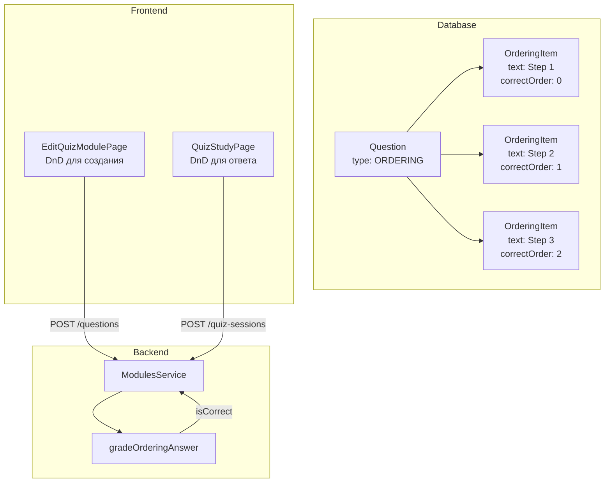
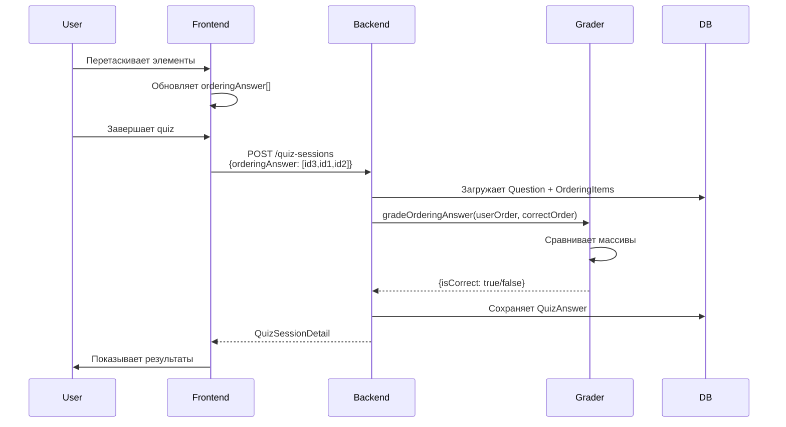

# План: Добавление типа вопроса ORDERING + интеграция Sentry

**Дата:** 2026-07-02  
**Автор:** Architect Mode  
**Связанные документы:** [`TODO.md`](../docs/TODO.md), [`AIContext.md`](../docs/AIContext.md)

---

## 📋 Обзор

### Цели

1. **Добавить новый тип вопроса ORDERING** в Quiz модуль для упорядочивания элементов
2. **Интегрировать Sentry** для мониторинга ошибок (backend + frontend)

### Текущее состояние

- ✅ 3 типа вопросов: `CHOICE`, `TEXT`, `MATCHING`
- ✅ Есть answer normalizer для TEXT ([`answer-normalizer.ts`](../backend/src/modules/quiz/answer-normalizer.ts))
- ❌ Sentry не интегрирован (фаза F в TODO)
- ⚠️ [`modules.service.ts`](../backend/src/modules/modules.service.ts) — god object (~1379 строк)

---

## 🎯 Часть 1: Тип вопроса ORDERING

### 1.1 Концепция

**ORDERING** — вопрос, где пользователь должен расположить элементы в правильном порядке.

**Примеры использования:**

- Этапы алгоритма (например, шаги сортировки пузырьком)
- Исторические события в хронологическом порядке
- Шаги рецепта или инструкции
- Приоритеты задач

**UX Flow:**

1. Пользователь видит перемешанные элементы
2. Drag-and-drop для изменения порядка
3. Система проверяет соответствие правильному порядку

---

### 1.2 Структура данных

#### Prisma Schema изменения

```prisma
enum QuestionType {
  CHOICE
  TEXT
  MATCHING
  ORDERING    // ← новый тип
}

// Новая таблица для элементов упорядочивания
model OrderingItem {
  id           String   @id @default(cuid())
  questionId   String
  text         String   // текст элемента
  correctOrder Int      // правильная позиция (0-based или 1-based)

  question Question @relation(fields: [questionId], references: [id], onDelete: Cascade)

  @@index([questionId])
  @@map("ordering_items")
}

// Обновить Question model
model Question {
  // ... существующие поля
  orderingItems   OrderingItem[]  // ← добавить
}
```

**Альтернативный подход:** использовать существующую таблицу `QuestionOption` с дополнительным полем `orderIndex`:

- ✅ Меньше изменений в схеме
- ❌ Семантически менее чистое решение
- ❌ Поле `isCorrect` не используется для ORDERING

**Рекомендация:** создать отдельную таблицу `OrderingItem` для чистоты архитектуры.

---

### 1.3 Логика проверки ответа

#### Backend: Grading алгоритм

```typescript
// В answer-normalizer.ts или новом файле ordering-grader.ts
export type OrderingGradeResult = {
  isCorrect: boolean;
  correctOrder: string[]; // массив ID в правильном порядке
  userOrder: string[]; // массив ID в порядке пользователя
  strictMatch: boolean; // полное совпадение
  partialScore?: number; // опционально: частичный балл (0-1)
};

export function gradeOrderingAnswer(
  userOrder: string[], // массив ID элементов от пользователя
  correctOrder: string[], // правильный порядок ID
  allowPartialCredit = false, // опция для будущего
): OrderingGradeResult {
  // Валидация
  if (userOrder.length !== correctOrder.length) {
    return {
      isCorrect: false,
      correctOrder,
      userOrder,
      strictMatch: false,
    };
  }

  // Проверка полного совпадения
  const strictMatch = userOrder.every((id, idx) => id === correctOrder[idx]);

  // Опционально: частичный балл (например, по алгоритму LCS)
  let partialScore: number | undefined;
  if (allowPartialCredit && !strictMatch) {
    partialScore = calculatePartialScore(userOrder, correctOrder);
  }

  return {
    isCorrect: strictMatch,
    correctOrder,
    userOrder,
    strictMatch,
    partialScore,
  };
}

// Опциональная функция для частичного балла
function calculatePartialScore(
  userOrder: string[],
  correctOrder: string[],
): number {
  // Вариант 1: Longest Common Subsequence (LCS)
  // Вариант 2: Kendall tau distance
  // Вариант 3: Простой подсчет правильных позиций

  let correctPositions = 0;
  for (let i = 0; i < userOrder.length; i++) {
    if (userOrder[i] === correctOrder[i]) {
      correctPositions++;
    }
  }
  return correctPositions / correctOrder.length;
}
```

#### Формат хранения ответа

В `QuizAnswer.userAnswer` (JSON):

```json
{
  "orderingAnswer": ["item-id-3", "item-id-1", "item-id-2", "item-id-4"]
}
```

---

### 1.4 Backend изменения

#### 1.4.1 Миграция БД

**Файл:** `backend/prisma/migrations/YYYYMMDDHHMMSS_add_ordering_question_type/migration.sql`

```sql
-- Добавить ORDERING в enum
ALTER TYPE "QuestionType" ADD VALUE 'ORDERING';

-- Создать таблицу ordering_items
CREATE TABLE "ordering_items" (
  "id" TEXT NOT NULL,
  "questionId" TEXT NOT NULL,
  "text" TEXT NOT NULL,
  "correctOrder" INTEGER NOT NULL,

  CONSTRAINT "ordering_items_pkey" PRIMARY KEY ("id")
);

CREATE INDEX "ordering_items_questionId_idx" ON "ordering_items"("questionId");

ALTER TABLE "ordering_items"
  ADD CONSTRAINT "ordering_items_questionId_fkey"
  FOREIGN KEY ("questionId")
  REFERENCES "questions"("id")
  ON DELETE CASCADE
  ON UPDATE CASCADE;
```

#### 1.4.2 ModulesService изменения

**Файл:** [`backend/src/modules/modules.service.ts`](../backend/src/modules/modules.service.ts)

**Изменения в `isQuestionType()`:**

```typescript
function isQuestionType(v: unknown): v is QuestionType {
  return (
    v === QuestionType.CHOICE ||
    v === QuestionType.TEXT ||
    v === QuestionType.MATCHING ||
    v === QuestionType.ORDERING // ← добавить
  );
}
```

**Изменения в `createQuestion()`** (строка ~916):

```typescript
if (body.type === QuestionType.ORDERING) {
  const items = body.orderingItems ?? [];
  if (items.length < 2) {
    throw new BadRequestException(
      'ORDERING questions require at least two items',
    );
  }

  // Валидация: каждый элемент должен иметь text и correctOrder
  for (let i = 0; i < items.length; i++) {
    const item = items[i];
    if (!item.text?.trim()) {
      throw new BadRequestException(`Item ${i + 1} must have non-empty text`);
    }
    if (typeof item.correctOrder !== 'number' || item.correctOrder < 0) {
      throw new BadRequestException(
        `Item ${i + 1} must have valid correctOrder (0-based index)`,
      );
    }
  }

  // Проверка уникальности correctOrder
  const orders = items.map((item) => item.correctOrder);
  const uniqueOrders = new Set(orders);
  if (uniqueOrders.size !== orders.length) {
    throw new BadRequestException(
      'Each item must have unique correctOrder value',
    );
  }

  return this.prisma.question.create({
    data: {
      moduleId,
      questionText,
      type: QuestionType.ORDERING,
      allowMultipleAnswers: false,
      orderIndex,
      orderingItems: {
        create: items.map((item) => ({
          text: item.text!.trim(),
          correctOrder: item.correctOrder!,
        })),
      },
    },
    include: {
      questionOptions: true,
      matchingPairs: true,
      orderingItems: true, // ← добавить
    },
  });
}
```

**Изменения в `createQuizSession()`** (строка ~744):

```typescript
} else if (q.type === QuestionType.ORDERING) {
  const userOrderIds = a.orderingAnswer ?? [];

  if (!Array.isArray(userOrderIds) || userOrderIds.length === 0) {
    isCorrect = false;
    userAnswer = null;
  } else {
    // Получить правильный порядок из orderingItems
    const items = q.orderingItems.sort((a, b) => a.correctOrder - b.correctOrder);
    const correctOrderIds = items.map(item => item.id);

    // Валидация: все ID должны существовать
    const itemsById = new Map(q.orderingItems.map(item => [item.id, item]));
    if (userOrderIds.some(id => !itemsById.has(id))) {
      throw new BadRequestException(
        'orderingAnswer contains invalid item IDs',
      );
    }

    // Проверка: все элементы должны быть использованы ровно один раз
    if (userOrderIds.length !== correctOrderIds.length ||
        new Set(userOrderIds).size !== userOrderIds.length) {
      throw new BadRequestException(
        'orderingAnswer must contain each item exactly once',
      );
    }

    // Grading
    const grade = gradeOrderingAnswer(userOrderIds, correctOrderIds);
    isCorrect = grade.isCorrect;
    userAnswer = JSON.stringify({
      orderingAnswer: grade.userOrder,
      // опционально сохранить partialScore для будущего
    });
  }
}
```

**Изменения в `updateQuestion()`** (строка ~1067):

```typescript
if (body.type === QuestionType.ORDERING && body.orderingItems === undefined) {
  throw new BadRequestException(
    'orderingItems required when changing to ORDERING type',
  );
}

// ... позже в функции
if (nextType === QuestionType.ORDERING && body.orderingItems !== undefined) {
  const items = body.orderingItems;
  // Валидация (аналогично createQuestion)
  // ...

  // Удалить старые items
  await this.prisma.orderingItem.deleteMany({ where: { questionId } });

  // Создать новые
  await this.prisma.orderingItem.createMany({
    data: items.map((item) => ({
      questionId,
      text: item.text!.trim(),
      correctOrder: item.correctOrder!,
    })),
  });
}
```

#### 1.4.3 TypeScript типы

**Добавить в DTO или inline типы:**

```typescript
type CreateOrderingQuestionBody = {
  questionText: string;
  type: 'ORDERING';
  orderIndex?: number;
  orderingItems: Array<{
    text: string;
    correctOrder: number;
  }>;
};
```

---

### 1.5 Frontend изменения

#### 1.5.1 TypeScript типы

**Файл:** [`frontend/src/types/module.ts`](../frontend/src/types/module.ts)

```typescript
export type QuestionType = 'CHOICE' | 'TEXT' | 'MATCHING' | 'ORDERING';

export interface ModuleOrderingItem {
  id: string;
  questionId: string;
  text: string;
  correctOrder: number;
}

export interface ModuleQuestion {
  // ... существующие поля
  orderingItems: ModuleOrderingItem[]; // ← добавить
}

export type QuizOrderingUserAnswer = {
  orderingAnswer: string[]; // массив ID в порядке пользователя
};

export type QuizUserAnswer =
  | QuizChoiceUserAnswer
  | QuizTextUserAnswer
  | QuizMatchingUserAnswer
  | QuizOrderingUserAnswer; // ← добавить
```

#### 1.5.2 Редактор вопросов

**Файл:** [`frontend/src/pages/EditQuizModulePage.tsx`](../frontend/src/pages/EditQuizModulePage.tsx)

**Изменения:**

1. **Добавить ORDERING в список типов** (строка ~680):

```typescript
const QUESTION_TYPES = useMemo(
  () => [
    ...getQuestionTypes(t),
    { value: 'ORDERING', label: t('editQuiz.typeOrdering') },
  ],
  [t],
);
```

2. **State для ordering items:**

```typescript
const [orderingItems, setOrderingItems] = useState<
  Array<{
    id: string; // временный ID для UI
    text: string;
    correctOrder: number;
  }>
>([]);
```

3. **UI для редактирования ORDERING:**

```tsx
{
  type === 'ORDERING' ? (
    <div>
      <label className="block text-sm font-medium mb-2">
        {t('editQuiz.orderingItems')}
      </label>

      {/* Список элементов с drag-and-drop */}
      <DndContext
        sensors={sensors}
        collisionDetection={closestCenter}
        onDragEnd={handleOrderingDragEnd}
      >
        <SortableContext
          items={orderingItems.map((item) => item.id)}
          strategy={verticalListSortingStrategy}
        >
          {orderingItems.map((item, index) => (
            <OrderingItemRow
              key={item.id}
              item={item}
              index={index}
              onTextChange={(text) => updateOrderingItemText(item.id, text)}
              onRemove={() => removeOrderingItem(item.id)}
            />
          ))}
        </SortableContext>
      </DndContext>

      <Button
        type="button"
        variant="outline"
        size="sm"
        onClick={addOrderingItem}
        className="mt-2"
      >
        <Plus className="w-4 h-4 mr-1" />
        {t('editQuiz.addOrderingItem')}
      </Button>

      <p className="text-xs text-muted-foreground mt-2">
        {t('editQuiz.orderingHint')}
      </p>
    </div>
  ) : null;
}
```

4. **Валидация перед сохранением:**

```typescript
if (type === 'ORDERING') {
  const cleanItems = orderingItems
    .map((item) => ({ ...item, text: item.text.trim() }))
    .filter((item) => item.text);

  if (cleanItems.length < 2) {
    nextErrors.orderingItems = t('editQuiz.validationOrderingMinItems');
    setErrors(nextErrors);
    return;
  }

  payload.orderingItems = cleanItems.map((item, index) => ({
    text: item.text,
    correctOrder: index, // порядок определяется позицией в массиве
  }));
}
```

5. **Export/Import JSON:**

```typescript
function toExportQuestion(q: ModuleQuestion) {
  // ...
  if (q.type === 'ORDERING') {
    return {
      type: 'ORDERING',
      question: q.questionText,
      items: q.orderingItems
        .sort((a, b) => a.correctOrder - b.correctOrder)
        .map((item) => item.text),
    };
  }
}
```

#### 1.5.3 Quiz Study Page

**Файл:** [`frontend/src/pages/QuizStudyPage.tsx`](../frontend/src/pages/QuizStudyPage.tsx)

**Изменения:**

1. **Draft answer state:**

```typescript
type DraftAnswer = {
  choiceOptionIds?: string[];
  textAnswer?: string;
  matchingAnswer?: Record<string, string>;
  orderingAnswer?: string[]; // ← добавить
};
```

2. **Проверка ответа:**

```typescript
function isQuestionAnswered(
  question: ModuleQuestion,
  draft: DraftAnswer | undefined,
) {
  // ...
  if (question.type === 'ORDERING') {
    const items = Array.isArray(question.orderingItems)
      ? question.orderingItems
      : [];
    const userOrder = draft.orderingAnswer ?? [];
    // Проверяем, что все элементы расставлены
    return userOrder.length === items.length;
  }
}
```

3. **UI для прохождения:**

```tsx
{
  currentQuestion.type === 'ORDERING' ? (
    <div className="mt-6 space-y-3">
      <p className="text-sm text-muted-foreground">
        {t('quizStudy.orderingInstruction')}
      </p>

      <DndContext
        sensors={sensors}
        collisionDetection={closestCenter}
        onDragEnd={handleOrderingDragEnd}
      >
        <SortableContext
          items={currentOrderingItems.map((item) => item.id)}
          strategy={verticalListSortingStrategy}
        >
          {currentOrderingItems.map((item, index) => (
            <SortableOrderingItem
              key={item.id}
              item={item}
              index={index}
              disabled={showResults}
            />
          ))}
        </SortableContext>
      </DndContext>
    </div>
  ) : null;
}
```

4. **Отображение результатов:**

```typescript
function formatOrderingUserAnswer(
  answer: QuizSessionAnswerDetail,
  t: I18nMessages,
) {
  const q = answer.question;
  if (!answer.userAnswer || !('orderingAnswer' in answer.userAnswer)) {
    return t('quizStudy.noAnswer');
  }

  const userOrderIds = answer.userAnswer.orderingAnswer;
  const itemsById = new Map(q.orderingItems.map((item) => [item.id, item]));

  return userOrderIds
    .map((id, index) => {
      const item = itemsById.get(id);
      const isCorrect = item?.correctOrder === index;
      return `${index + 1}. ${item?.text ?? '?'} ${isCorrect ? '✓' : '✗'}`;
    })
    .join('\n');
}
```

#### 1.5.4 Компонент SortableOrderingItem

**Новый файл:** `frontend/src/components/modules/SortableOrderingItem.tsx`

```tsx
import { useSortable } from '@dnd-kit/sortable';
import { CSS } from '@dnd-kit/utilities';
import { GripVertical } from 'lucide-react';
import { cn } from '@/lib/utils';

interface SortableOrderingItemProps {
  item: { id: string; text: string };
  index: number;
  disabled?: boolean;
  showCorrectness?: boolean;
  isCorrect?: boolean;
}

export function SortableOrderingItem({
  item,
  index,
  disabled = false,
  showCorrectness = false,
  isCorrect,
}: SortableOrderingItemProps) {
  const {
    attributes,
    listeners,
    setNodeRef,
    transform,
    transition,
    isDragging,
  } = useSortable({ id: item.id, disabled });

  const style = {
    transform: CSS.Transform.toString(transform),
    transition,
  };

  return (
    <div
      ref={setNodeRef}
      style={style}
      className={cn(
        'flex items-center gap-3 p-3 rounded-lg border bg-card',
        isDragging && 'opacity-50',
        showCorrectness &&
          isCorrect &&
          'border-green-500 bg-green-50 dark:bg-green-950',
        showCorrectness &&
          !isCorrect &&
          'border-red-500 bg-red-50 dark:bg-red-950',
        !disabled && 'cursor-move hover:border-primary',
      )}
    >
      {!disabled && (
        <div
          {...attributes}
          {...listeners}
          className="cursor-grab active:cursor-grabbing"
        >
          <GripVertical className="w-5 h-5 text-muted-foreground" />
        </div>
      )}

      <div className="flex-1 flex items-center gap-2">
        <span className="font-medium text-muted-foreground">{index + 1}.</span>
        <span>{item.text}</span>
      </div>

      {showCorrectness && (
        <span
          className={cn(
            'text-sm font-medium',
            isCorrect ? 'text-green-600' : 'text-red-600',
          )}
        >
          {isCorrect ? '✓' : '✗'}
        </span>
      )}
    </div>
  );
}
```

---

### 1.6 i18n сообщения

**Файл:** [`frontend/src/i18n/messages.ts`](../frontend/src/i18n/messages.ts)

```typescript
editQuiz: {
  // ...
  typeOrdering: 'Упорядочивание',
  orderingItems: 'Элементы для упорядочивания',
  orderingHint: 'Расположите элементы в правильном порядке. Перетаскивайте для изменения.',
  addOrderingItem: 'Добавить элемент',
  validationOrderingMinItems: 'Требуется минимум 2 элемента',
},

quizStudy: {
  // ...
  orderingInstruction: 'Расположите элементы в правильном порядке, перетаскивая их.',
},
```

---

### 1.7 Тестирование

#### Unit тесты

**Файл:** `backend/src/modules/quiz/ordering-grader.spec.ts`

```typescript
import { gradeOrderingAnswer } from './ordering-grader';

describe('gradeOrderingAnswer', () => {
  it('засчитывает правильный порядок', () => {
    const result = gradeOrderingAnswer(
      ['id1', 'id2', 'id3'],
      ['id1', 'id2', 'id3'],
    );
    expect(result.isCorrect).toBe(true);
    expect(result.strictMatch).toBe(true);
  });

  it('отклоняет неправильный порядок', () => {
    const result = gradeOrderingAnswer(
      ['id2', 'id1', 'id3'],
      ['id1', 'id2', 'id3'],
    );
    expect(result.isCorrect).toBe(false);
  });

  it('отклоняет неполный ответ', () => {
    const result = gradeOrderingAnswer(['id1', 'id2'], ['id1', 'id2', 'id3']);
    expect(result.isCorrect).toBe(false);
  });

  it('вычисляет частичный балл (опционально)', () => {
    const result = gradeOrderingAnswer(
      ['id1', 'id3', 'id2'],
      ['id1', 'id2', 'id3'],
      true, // allowPartialCredit
    );
    expect(result.isCorrect).toBe(false);
    expect(result.partialScore).toBeCloseTo(0.33, 1); // 1 из 3 правильно
  });
});
```

#### E2E тесты (Playwright)

```typescript
test('создание и прохождение ORDERING вопроса', async ({ page }) => {
  // 1. Создать модуль
  // 2. Добавить ORDERING вопрос с 3 элементами
  // 3. Пройти quiz
  // 4. Проверить правильность оценки
});
```

---

## 🔍 Часть 2: Интеграция Sentry

### 2.1 Обзор

**Sentry** — платформа для мониторинга ошибок и производительности приложений.

**Что даст интеграция:**

- ✅ Автоматический сбор ошибок (frontend + backend)
- ✅ Stack traces с source maps
- ✅ Контекст ошибок (user, request, breadcrumbs)
- ✅ Алерты в Slack/email
- ✅ Performance monitoring (опционально)

---

### 2.2 Backend интеграция

#### 2.2.1 Установка пакетов

```bash
cd backend
npm install @sentry/nestjs @sentry/node
```

#### 2.2.2 Конфигурация

**Файл:** [`backend/src/main.ts`](../backend/src/main.ts)

```typescript
import { ValidationPipe } from '@nestjs/common';
import { NestFactory } from '@nestjs/core';
import * as Sentry from '@sentry/nestjs';
import { nodeProfilingIntegration } from '@sentry/profiling-node';
import cookieParser from 'cookie-parser';
import { AppModule } from './app.module';

async function bootstrap() {
  // Инициализация Sentry ДО создания приложения
  if (process.env.SENTRY_DSN) {
    Sentry.init({
      dsn: process.env.SENTRY_DSN,
      environment: process.env.SENTRY_ENVIRONMENT || 'development',
      release: process.env.SENTRY_RELEASE,

      // Интеграции
      integrations: [nodeProfilingIntegration()],

      // Sample rate для production
      tracesSampleRate: process.env.NODE_ENV === 'production' ? 0.1 : 1.0,
      profilesSampleRate: process.env.NODE_ENV === 'production' ? 0.1 : 1.0,

      // Не логировать PII
      beforeSend(event, hint) {
        // Удалить чувствительные данные из контекста
        if (event.request?.cookies) {
          delete event.request.cookies;
        }
        if (event.request?.headers?.authorization) {
          event.request.headers.authorization = '[Filtered]';
        }
        return event;
      },
    });
  }

  const app = await NestFactory.create(AppModule);

  // ... остальная конфигурация

  const port = Number(process.env.PORT) || 3001;
  await app.listen(port);
}
void bootstrap();
```

#### 2.2.3 Global Exception Filter

**Файл:** `backend/src/common/filters/sentry-exception.filter.ts`

```typescript
import {
  ArgumentsHost,
  Catch,
  ExceptionFilter,
  HttpException,
  HttpStatus,
} from '@nestjs/common';
import * as Sentry from '@sentry/nestjs';
import { Request, Response } from 'express';

@Catch()
export class SentryExceptionFilter implements ExceptionFilter {
  catch(exception: unknown, host: ArgumentsHost) {
    const ctx = host.switchToHttp();
    const response = ctx.getResponse<Response>();
    const request = ctx.getRequest<Request>();

    const status =
      exception instanceof HttpException
        ? exception.getStatus()
        : HttpStatus.INTERNAL_SERVER_ERROR;

    const message =
      exception instanceof HttpException
        ? exception.message
        : 'Internal server error';

    // Логировать в Sentry только 5xx ошибки
    if (status >= 500) {
      Sentry.captureException(exception, {
        contexts: {
          http: {
            method: request.method,
            url: request.url,
            status_code: status,
          },
        },
        user: {
          id: (request as any).user?.id,
          email: (request as any).user?.email,
        },
        tags: {
          endpoint: `${request.method} ${request.route?.path || request.url}`,
        },
      });
    } else if (status >= 400) {
      // 4xx — только breadcrumb
      Sentry.addBreadcrumb({
        category: 'http',
        message: `${request.method} ${request.url} - ${status}`,
        level: 'warning',
        data: {
          status,
          message,
        },
      });
    }

    response.status(status).json({
      statusCode: status,
      message,
      timestamp: new Date().toISOString(),
      path: request.url,
    });
  }
}
```

**Регистрация в AppModule:**

```typescript
import { APP_FILTER } from '@nestjs/core';
import { SentryExceptionFilter } from './common/filters/sentry-exception.filter';

@Module({
  providers: [
    {
      provide: APP_FILTER,
      useClass: SentryExceptionFilter,
    },
  ],
})
export class AppModule {}
```

#### 2.2.4 Structured Logging (опционально)

**Файл:** `backend/src/modules/modules.service.ts`

```typescript
import { Logger } from '@nestjs/common';

export class ModulesService {
  private readonly logger = new Logger(ModulesService.name);

  async createQuizSession(...) {
    try {
      // ... логика grading
      this.logger.log(`Quiz session created: ${session.id}, score: ${scorePercent}%`);
      return session;
    } catch (error) {
      this.logger.error(`Failed to create quiz session for module ${moduleId}`, error);
      throw error;
    }
  }
}
```

---

### 2.3 Frontend интеграция

#### 2.3.1 Установка пакетов

```bash
cd frontend
npm install @sentry/react
```

#### 2.3.2 Конфигурация

**Файл:** [`frontend/src/main.tsx`](../frontend/src/main.tsx)

```typescript
import * as Sentry from '@sentry/react';
import { StrictMode } from 'react';
import { createRoot } from 'react-dom/client';
import { Provider } from 'react-redux';
import { RouterProvider } from 'react-router-dom';
import { Toaster } from 'react-hot-toast';
import { AuthProvider } from './auth/AuthContext';
import { I18nProvider } from './i18n/I18nProvider';
import { ThemeProvider } from './theme/ThemeProvider';
import { router } from './router';
import { store } from './store/store';
import './index.css';

// Инициализация Sentry
if (import.meta.env.VITE_SENTRY_DSN) {
  Sentry.init({
    dsn: import.meta.env.VITE_SENTRY_DSN,
    environment: import.meta.env.VITE_SENTRY_ENVIRONMENT || import.meta.env.MODE,
    release: import.meta.env.VITE_SENTRY_RELEASE,

    integrations: [
      Sentry.browserTracingIntegration(),
      Sentry.replayIntegration({
        maskAllText: true,
        blockAllMedia: true,
      }),
    ],

    // Performance monitoring
    tracesSampleRate: import.meta.env.PROD ? 0.1 : 1.0,

    // Session replay
    replaysSessionSampleRate: 0.1,
    replaysOnErrorSampleRate: 1.0,

    // Не отправлять PII
    beforeSend(event, hint) {
      // Удалить email из user context
      if (event.user?.email) {
        event.user.email = '[Filtered]';
      }
      return event;
    },
  });
}

createRoot(document.getElementById('root')!).render(
  <StrictMode>
    <Sentry.ErrorBoundary
      fallback={({ error, resetError }) => (
        <div className="min-h-screen flex items-center justify-center p-4">
          <div className="max-w-md w-full bg-card border rounded-lg p-6">
            <h1 className="text-xl font-bold text-destructive mb-2">
              Произошла ошибка
            </h1>
            <p className="text-sm text-muted-foreground mb-4">
              Мы уже получили уведомление об этой проблеме.
            </p>
            <button
              onClick={resetError}
              className="px-4 py-2 bg-primary text-primary-foreground rounded-md"
            >
              Попробовать снова
            </button>
          </div>
        </div>
      )}
      showDialog={false}
    >
      <Provider store={store}>
        <ThemeProvider>
          <I18nProvider>
            <AuthProvider>
              <RouterProvider router={router} />
              <Toaster position="top-right" />
            </AuthProvider>
          </I18nProvider>
        </ThemeProvider>
      </Provider>
    </Sentry.ErrorBoundary>
  </StrictMode>,
);
```

#### 2.3.3 Error Boundary в RouteErrorPage

**Файл:** [`frontend/src/pages/RouteErrorPage.tsx`](../frontend/src/pages/RouteErrorPage.tsx)

```typescript
import * as Sentry from '@sentry/react';
import { useRouteError } from 'react-router-dom';

export function RouteErrorPage() {
  const error = useRouteError();

  // Отправить в Sentry
  React.useEffect(() => {
    if (error) {
      Sentry.captureException(error);
    }
  }, [error]);

  // ... остальной UI
}
```

#### 2.3.4 Ручная отправка ошибок

В критических местах можно добавить ручную отправку:

```typescript
try {
  await createQuizSession(moduleId, answers);
} catch (error) {
  Sentry.captureException(error, {
    tags: {
      feature: 'quiz-session',
      moduleId,
    },
    contexts: {
      quiz: {
        questionCount: answers.length,
      },
    },
  });
  toast.error('Не удалось сохранить результаты');
}
```

---

### 2.4 Переменные окружения

#### Backend `.env`

```bash
# Sentry
SENTRY_DSN=https://examplePublicKey@o0.ingest.sentry.io/0
SENTRY_ENVIRONMENT=production
SENTRY_RELEASE=quizoo-backend@1.0.0
```

#### Frontend `.env`

```bash
# Sentry
VITE_SENTRY_DSN=https://examplePublicKey@o0.ingest.sentry.io/0
VITE_SENTRY_ENVIRONMENT=production
VITE_SENTRY_RELEASE=quizoo-frontend@1.0.0
```

#### Обновить `.env.example`

**Файл:** [`.env.example`](../.env.example)

```bash
# ── Analytics / Monitoring ───────────────────────
# Sentry DSN для мониторинга ошибок (опционально)
# Получить на https://sentry.io
SENTRY_DSN=
SENTRY_ENVIRONMENT=development
SENTRY_RELEASE=

# Frontend Sentry (для Vite)
VITE_SENTRY_DSN=
VITE_SENTRY_ENVIRONMENT=development
VITE_SENTRY_RELEASE=
```

---

### 2.5 Source Maps (опционально)

Для production рекомендуется загружать source maps в Sentry для читаемых stack traces.

#### Backend

```bash
npm install --save-dev @sentry/cli

# В package.json
{
  "scripts": {
    "build": "nest build",
    "sentry:sourcemaps": "sentry-cli sourcemaps upload --org=your-org --project=quizoo-backend ./dist"
  }
}
```

#### Frontend

```bash
npm install --save-dev @sentry/vite-plugin

# vite.config.ts
import { sentryVitePlugin } from '@sentry/vite-plugin';

export default defineConfig({
  plugins: [
    react(),
    sentryVitePlugin({
      org: 'your-org',
      project: 'quizoo-frontend',
      authToken: process.env.SENTRY_AUTH_TOKEN,
    }),
  ],
  build: {
    sourcemap: true,
  },
});
```

---

### 2.6 Тестирование Sentry

#### Тестовый endpoint

**Файл:** `backend/src/app.controller.ts`

```typescript
@Get('sentry-test')
testSentry() {
  throw new Error('Sentry test error from backend');
}
```

#### Тестовая кнопка (dev only)

```tsx
{
  import.meta.env.DEV && (
    <button
      onClick={() => {
        throw new Error('Sentry test error from frontend');
      }}
    >
      Test Sentry
    </button>
  );
}
```

---

### 2.7 Мониторинг и алерты

**Рекомендуемые настройки в Sentry Dashboard:**

1. **Alert Rules:**
   - Новая ошибка в production → Slack/Email
   - Spike в количестве ошибок (>10 за 5 мин)
   - Критические ошибки (5xx) → немедленное уведомление

2. **Issue Grouping:**
   - По stack trace
   - По endpoint (для backend)
   - По компоненту (для frontend)

3. **Performance Monitoring:**
   - Slow transactions (>2s)
   - Database queries (>500ms)
   - API endpoints latency

4. **Release Tracking:**
   - Связать релизы с Git commits
   - Отслеживать регрессии между релизами

---

## 📊 Диаграммы

### Архитектура ORDERING вопроса



### Поток проверки ORDERING ответа



### Sentry Error Flow

```mermaid
graph LR
    subgraph Application
        FE[Frontend Error]
        BE[Backend Error]
    end

    subgraph Sentry
        Ingest[Ingest API]
        Process[Processing]
        Store[Event Store]
        Alert[Alert Rules]
    end

    subgraph Notifications
        Slack[Slack]
        Email[Email]
        Dashboard[Sentry Dashboard]
    end

    FE -->|@sentry/react| Ingest
    BE -->|@sentry/nestjs| Ingest
    Ingest --> Process
    Process --> Store
    Store --> Alert
    Alert --> Slack
    Alert --> Email
    Store --> Dashboard
```

---

## ✅ Чеклист реализации

### ORDERING Question Type

#### Backend

- [ ] Добавить `ORDERING` в `QuestionType` enum (Prisma)
- [ ] Создать таблицу `ordering_items` (миграция)
- [ ] Создать `ordering-grader.ts` с функцией `gradeOrderingAnswer()`
- [ ] Обновить `isQuestionType()` в `modules.service.ts`
- [ ] Реализовать `createQuestion()` для ORDERING
- [ ] Реализовать `updateQuestion()` для ORDERING
- [ ] Реализовать grading в `createQuizSession()`
- [ ] Добавить `orderingItems` в Prisma includes
- [ ] Написать unit тесты для `ordering-grader`
- [ ] Обновить существующие тесты `modules.service.spec.ts`

#### Frontend

- [ ] Добавить `ORDERING` в `QuestionType` type
- [ ] Добавить `ModuleOrderingItem` interface
- [ ] Добавить `QuizOrderingUserAnswer` type
- [ ] Обновить `EditQuizModulePage`: UI для создания ORDERING
- [ ] Реализовать drag-and-drop в редакторе
- [ ] Обновить валидацию вопросов
- [ ] Обновить JSON export/import
- [ ] Обновить `QuizStudyPage`: UI для прохождения ORDERING
- [ ] Реализовать drag-and-drop в study mode
- [ ] Обновить отображение результатов
- [ ] Создать компонент `SortableOrderingItem`
- [ ] Добавить i18n сообщения (ru/en)

#### Тестирование

- [ ] Unit тесты backend (ordering-grader)
- [ ] Integration тесты (modules.service)
- [ ] E2E тесты (Playwright) - создание и прохождение

#### Документация

- [ ] Обновить [`AIContext.md`](../docs/AIContext.md)
- [ ] Обновить [`TODO.md`](../docs/TODO.md)
- [ ] Создать session doc в `docs/sessions/`
- [ ] Обновить [`api.md`](../docs/api.md) с примерами ORDERING

---

### Sentry Integration

#### Backend

- [ ] Установить `@sentry/nestjs`, `@sentry/node`
- [ ] Инициализировать Sentry в `main.ts`
- [ ] Создать `SentryExceptionFilter`
- [ ] Зарегистрировать filter в `AppModule`
- [ ] Добавить structured logging в критических местах
- [ ] Настроить `beforeSend` для фильтрации PII
- [ ] Добавить переменные окружения в `.env.example`
- [ ] Создать тестовый endpoint `/sentry-test`

#### Frontend

- [ ] Установить `@sentry/react`
- [ ] Инициализировать Sentry в `main.tsx`
- [ ] Обернуть приложение в `Sentry.ErrorBoundary`
- [ ] Обновить `RouteErrorPage` для отправки ошибок
- [ ] Настроить `beforeSend` для фильтрации PII
- [ ] Добавить переменные окружения в `.env.example`
- [ ] Добавить ручную отправку в критических местах

#### Инфраструктура

- [ ] Создать проекты в Sentry (backend + frontend)
- [ ] Настроить alert rules
- [ ] Настроить интеграцию со Slack (опционально)
- [ ] Настроить source maps upload (опционально)
- [ ] Документировать в [`docker-stack-guide.md`](../docs/docker-stack-guide.md)

#### Документация

- [ ] Обновить [`AIContext.md`](../docs/AIContext.md) - раздел мониторинга
- [ ] Отметить фазу F как выполненную в [`TODO.md`](../docs/TODO.md)
- [ ] Создать `docs/monitoring.md` с инструкциями по Sentry

---

## 🎯 Приоритеты и порядок выполнения

### Фаза 1: ORDERING - Backend (2-3 дня)

1. Миграция БД + Prisma schema
2. `ordering-grader.ts` + unit тесты
3. CRUD операции в `modules.service.ts`
4. Grading в `createQuizSession()`
5. Integration тесты

### Фаза 2: ORDERING - Frontend (3-4 дня)

1. TypeScript типы
2. Редактор вопросов (EditQuizModulePage)
3. Study page (QuizStudyPage)
4. Компонент SortableOrderingItem
5. i18n сообщения
6. E2E тесты

### Фаза 3: Sentry - Backend (1 день)

1. Установка и инициализация
2. Exception filter
3. Переменные окружения
4. Тестирование

### Фаза 4: Sentry - Frontend (1 день)

1. Установка и инициализация
2. Error boundary
3. Переменные окружения
4. Тестирование

### Фаза 5: Документация и финализация (1 день)

1. Обновление всех docs
2. Session notes
3. Проверка всех чеклистов
4. Code review

---

## 🔗 Связанные документы

- [`TODO.md`](../docs/TODO.md) - фаза C (новые типы вопросов), фаза F (Sentry)
- [`AIContext.md`](../docs/AIContext.md) - общий контекст проекта
- [`architecture.md`](../docs/architecture.md) - архитектура системы
- [`api.md`](../docs/api.md) - API документация
- [`db.md`](../docs/db.md) - структура БД
- [`answer-normalizer.ts`](../backend/src/modules/quiz/answer-normalizer.ts) - пример grader
- [`modules.service.ts`](../backend/src/modules/modules.service.ts) - основной сервис

---

## 📝 Примечания

### Альтернативные подходы для ORDERING

1. **Использовать QuestionOption вместо OrderingItem:**
   - ✅ Меньше изменений в схеме
   - ❌ Семантически неправильно
   - ❌ Поле `isCorrect` не используется

2. **Хранить порядок в JSON поле:**
   - ✅ Гибкость
   - ❌ Сложнее валидация
   - ❌ Хуже для запросов

3. **Частичный балл (partial credit):**
   - Можно добавить позже
   - Алгоритмы: LCS, Kendall tau, простой подсчет
   - Требует изменений в UI для отображения

### Рекомендации по Sentry

1. **Не логировать PII:**
   - Email, пароли, JWT токены
   - Использовать `beforeSend` для фильтрации

2. **Sample rates для production:**
   - Traces: 10% (0.1)
   - Replays: 10% обычных, 100% с ошибками
   - Профилирование: 10%

3. **Alert fatigue:**
   - Не создавать алерты на каждую ошибку
   - Группировать похожие ошибки
   - Настроить thresholds (spike detection)

4. **Performance budget:**
   - Sentry SDK добавляет ~50KB к bundle
   - Минимальное влияние на производительность
   - Можно отключить в dev через env vars

---

## ❓ Вопросы для обсуждения

1. **ORDERING: Нужен ли частичный балл?**
   - Сейчас: только strict match (все правильно или нет)
   - Альтернатива: балл за частично правильный порядок

2. **ORDERING: Минимальное количество элементов?**
   - Сейчас: минимум 2
   - Рекомендация: 3-4 для осмысленного вопроса

3. **Sentry: Отдельные DSN для backend/frontend?**
   - Рекомендация: да, для раздельной аналитики
   - Альтернатива: один DSN, разделение по tags

4. **Sentry: Нужен ли performance monitoring?**
   - Полезно для production
   - Дополнительная стоимость в Sentry
   - Можно включить позже

5. **Декомпозиция modules.service.ts:**
   - Сейчас: god object ~1379 строк
   - Рекомендация: выделить QuizGradingService перед добавлением ORDERING
   - См. TODO фаза A

---

**Конец плана**
